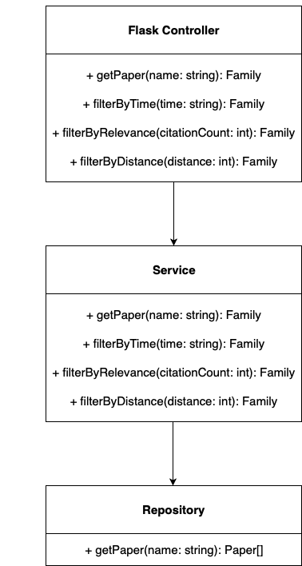
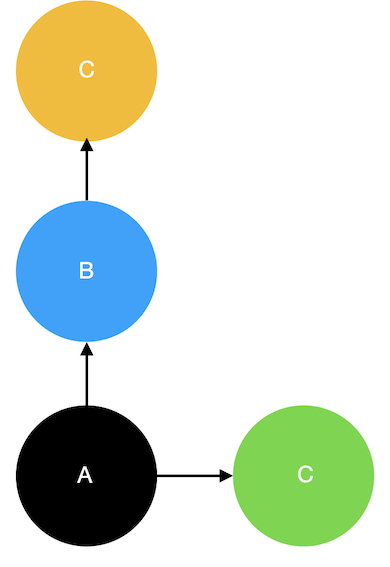
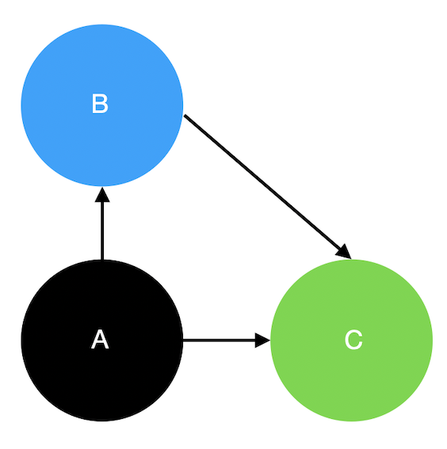
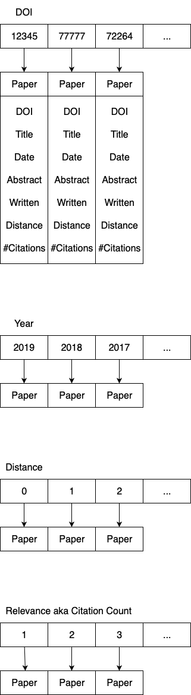

# Backend Architecture
The user always first selects a paper in the frontend and then filters and sorts the paper family. 
For this, the backend should compute the family of a paper and prepare the output so that afterwards the backend can 
filter quickly and the frontend can sort quickly. 

## Backend Components
The backend consists of a Flask controller, a service, and a repository. 
The Flask controller manages the REST API for the frontend. 
The service takes over the actual backend logic. 
We use the repository to access the database entities. 

### Repository
The getPapers call of the repository recursively queries the database for the family of the paper.
Query: 
                
                with recursive family(from_paper, from_title, from_abstract, from_year, to_paper, to_title, to_abstract, to_year) as (
                	select pf.id, pf.title, pf.abstract, pf.year, pt.id, pt.title, pt.abstract, pt.year
                    from paper pf, reference r, paper pt
                    where pf.id == r.from_paper and pf.title == '" + title + "' and pt.id == r.to_paper
                            
                    	UNION ALL
                  
                    select f.to_paper as from_paper, f.to_title as from_title, f.to_abstract as from_abstract, f.to_year as from_year, pt.id as to_paper, pt.title as to_title, pt.abstract as to_abstract, pt.year as to_year
                    from family f, reference r, paper pt
                    where f.to_paper == r.from_paper and pt.id == r.to_paper)
                            
                select *
                from family
                
The query will return something like this:

### Service
The service will then transform the received family into something like this:

Thereby, the service will count how often a paper is referenced in the family.
In addition, the service pre-sorts the resulting family by time, distance, and relevance, and caches these results to 
facilitate later filtering and sorting. To do this, the service stores the following maps locally:

### Flask Controller
The Flask Controller acts as the REST API. 
It forwards the UI actions to the Service and returns the computed paper families back to the frontend.

## Database schema
A paper has a DOI, a title, an Abstract and it is written on a fixed date. 
A paper references none, one, or several papers and it is never, once, or several times referenced. 
A paper has at least one author and several authors can work on a paper from different institutes. 
Each author and each institute have a name.

