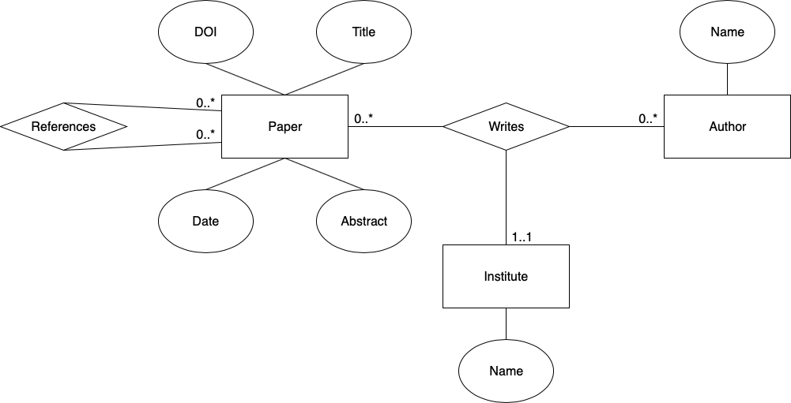

# Backend Architecture
## Database schema
A paper has a DOI, a title, an Abstract and it is written on a fixed date. 
A paper references none, one, or several papers and it is never, once, or several times referenced. 
A paper has at least one author and several authors can work on a paper from different institutes. 
Each author and each institute have a name.

