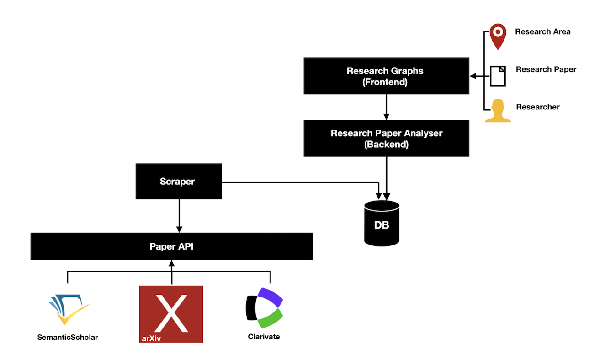

# Vision
The Research Paper Analyser examines to what extent research work is related to each other, 
i.e. whether and how often it refers to each other. 
For example, if paper C is based on paper B and paper B is based on paper A, then papers A, B and C are connected. 

## Motivation
When we read a paper for our research and are interested in further work on our topic, 
we are sometimes not sure which reference of the paper or which reference of reference of the paper is appropriate. 
What we need here is a tool that gives us all the relevant papers for a particular paper. 
We want to filter and sort these papers according to their relevance for our research.

Sometimes we don't come across a special paper, but a whole field of research that interests us. 
On the one hand, we will ask ourselves which papers are relevant for the respective research area. 
On the other hand, we want to know into which topics our field can be subdivided.  
We therefore need an instrument that assigns families of research work to their research topic and their field of research.

When our government discusses a problem, it often involves external professors and asks them for advice. 
Our governments could choose these experts more safely if they were able to visualize all the experts on a particular topic. 
When a university calls a professor to a chair, their selection can be supported by a tool that visualizes all their candidates. 

## Goal
The Research Paper Analyser will examine related research papers in such a way that it firstly presents groups of 
papers that build on each other, secondly research areas with their respective papers, and thirdly groups of 
communicating researchers:

1. Given is a Paper B. 
In order to find similar papers to B, we pass the Research Paper Analyser our paper B, i.e. 
we give its name, its DOI, or its author.
The Research Paper Analyser now presents all papers on which our paper B is based, and it presents all papers 
that are based on our paper B in the form of a graph. 
Because these are potentially very many papers, we can filter and sort papers according to our interest, e.g.
we can filter and sort them by time, distance, or relevance.
When filtering, we can let the Research Paper Analyser only output papers from a certain period of time. 
Or we can only have it present papers with a certain keyword.
The Research Paper Analyser can sort papers by time, distance, and relevance. 
### Parameters for Filtering and Sorting
- The time of a paper is its year of origin. 
Example: Paper A was written in 2018. Its time is 2018.
- The distance of two papers indicates how closely they are related. 
Example: If paper A quotes paper B, i.e. they are directly connected, then their distance is 1. 
If a paper E quotes paper D that quotes paper C that quotes Paper B, then Paper E and Paper B are only indirectly connected.
They have a distance of 3. 
- The relevance of a paper counts its direct quotes. 
For example, if Paper A quotes both Paper B and Paper C, and if Paper B quotes Paper C, 
then this group of three quotes 0 times Paper A, 1 times Paper B, and 2 times Paper C. 
For this group, Paper C is the most relevant. 

For example, we might be particularly interested in those relatives of our paper B that were created around 2018. 
After sorting, the Research Paper Graph first shows us only relatives of paper B from 2018. 
If we zoom out the graph by scrolling over it, it also shows us papers from 2017 and 2019. 
The more we shrink the graph by scrolling, the more papers we see and the more scattered they are around 2018.

2. A research area is given, for example "Web Databases" or "Join Optimisation". 
In a Research Paper Graph we will be able to see all the papers from this research area. 
For this purpose, our Research Paper Analyser records all papers whose keywords contain the name of the research area. 
The Research Paper Analyser then classifies the papers thus recorded into their respective families. 
Families that consist of many papers with the research area in their keywords are considered to be relevant.

3. Given is researcher Bob. 
We ask ourselves which researchers Bob often communicates with due to a similar background. 
We give the Research Paper Analyser the name of the researcher -- Bob. 
The Research Paper Analyser identifies which paper families Bob is involved in and presents the names of the other 
researchers from those families. 
So, analogous to the Research Paper Graph, here we create a Researcher Graph. 

## Architecture
Our Research Paper Analyzer is composed of a scraper, a database, an analyzing backend and a graph-heavy frontend:
- The scraper stores the meta information and references of research papers in a database. 
It reads this data from a research API such as ResearchGate, Clarivate, ArXiv and Google Scholar and it 
adapts the format of the data to the schema of the underlying database. 
- The research graphs in the frontend represent firstly families of related research papers, 
secondly research areas with their respective work, 
and thirdly families of communicating researchers. 
The user can filter and sort the graphs according to his research interests. 
- The Research Paper Analyser acts as a backend. 
It translates the user's actions into equivalent database queries and 
passes the resulting data to the frontend in an efficiently usable format. 

## Scope
- In our project we will primarily read the papers from the ResearchGate API. 
Reading other papers and information from secondary APIs is optional. 
- We will primarily present families of papers as graphs, while we will only optionally present research areas and 
families of communicating researchers.
- We initially limit our filtering and sorting parameters to time, distance, and relevance.

